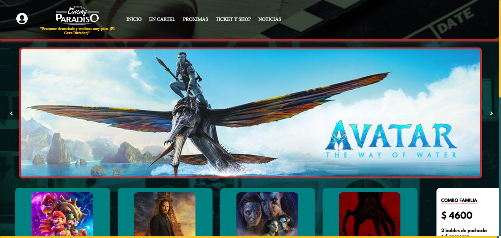

[//]: 

---
# 
 TUDAI
---
## 
 Tecnicatura Universitaria en Desarrollo de Aplicaciones Informáticas

### 
Asignatura: WEB 1
---
#### 
Trabajo Práctico Especial Nº2

---

### Documentación:

El presente informe desea dar a conocer los aspectos de la pagina que se presento como TPE Nº2:

* Diseñada con método First-Mobile
* Contiene 2 breakpoints: 
  - min-width: 480px
  - min-width: 768px
* La tabla dinámica se encuentra en el link a "Ticket y Shop" de la barra de navegacion.
* Paso previo a ver la tabla dinamica, deberá registrarse en el sitio (No olvide poner al menos su nombre).
* Una vez registrado podrá hacer uso del apartado de pedidos online.
* Si usted hace un pedido único por una cantidad igual o mayor a 3 unidades, se le hará un descuento del 20%, podrá darse cuenta al ver la fila resaltada con un color verde.
* Tiene la opción de cancelar su pedido o eliminar desde el último ingresado.

### Screenshots

El perfil del egresado incluye los siguientes rasgos distintivos:

* Trabajo en equipo, asumiendo las tareas y responsabilidades dentro de un grupo,

* Formación integral, entendiendo los conceptos teóricos dentro del análisis de casos reales,

* Capacidad para discutir ideas y alternativas para la solución de problemas,

